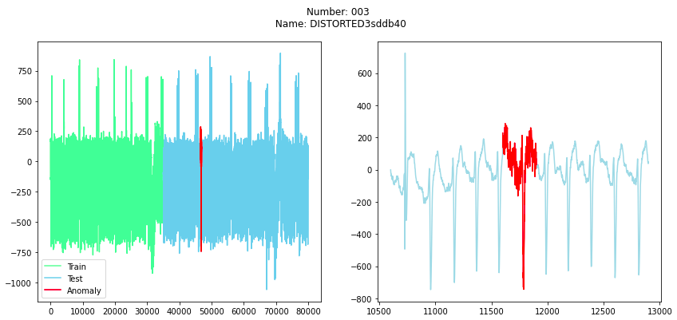
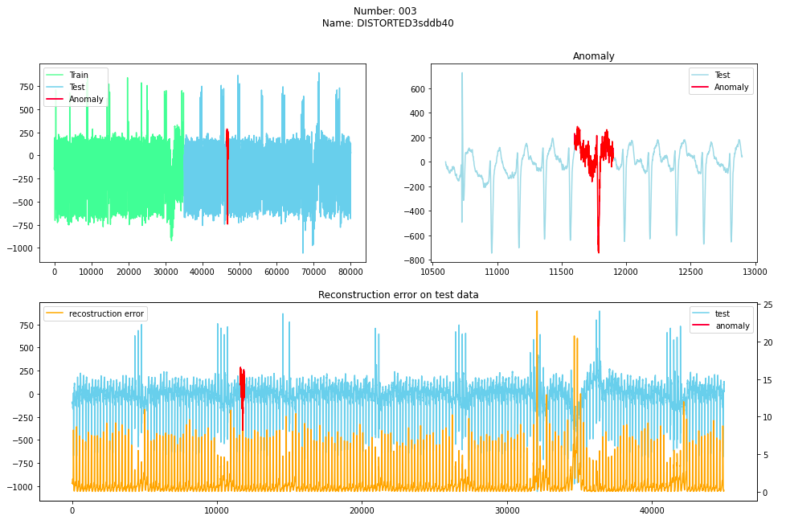

# Testing USAD on UCR dataset
The aim of this repository is to test how USAD (UnSupervised Anomaly 
Detection on multivariate time series) behaves on UCR Time Series Anomaly 
Archive dataset.

## Model
The model was created based on this paper: Audibert et al. USAD : 
[UnSupervised Anomaly Detection on multivariate time series.](https://dl.acm.org/doi/pdf/10.1145/3394486.3403392) 2020
and its implementation by [Francesco Galati - Github](https://github.com/manigalati/usad) 
. 

Full implementation can be found in `src/model.py`. 

Examples on how the model behaves on different dataset can be found in: 
[finloop/usad-torchlightning](https://github.com/finloop/usad-torchlightning).

## Data
The data comes from [UCR Time Series Anomaly Archive](https://wu.renjie.im/research/anomaly-benchmarks-are-flawed/#ucr-time-series-anomaly-archive)
. Download link: [https://www.cs.ucr.edu/~eamonn/time_series_data_2018/UCR_TimeSeriesAnomalyDatasets2021.zip](https://www.cs.ucr.edu/~eamonn/time_series_data_2018/UCR_TimeSeriesAnomalyDatasets2021.zip)

To run this put contents of `ZIPFILE/UCR_TimeSeriesAnomalyDatasets2021/FilesAreInHere/UCR_Anomaly_FullData` to `datasets/data`
. 

## How to run
Install requirements:
- pytorch
- pytorch-lightning
- jupyterlab

To run open and run: `notebooks/UCR_Anomaly.ipynb`.

# Results
The model (for now) was tested on dataset 003. This is how it looks:

The model seems to perform poorly. It is unable to find the desired anomaly(
the bigger the reconstruction error - the 
stronger the anomaly). The biggest reconstruction error is not near the red 
area.

